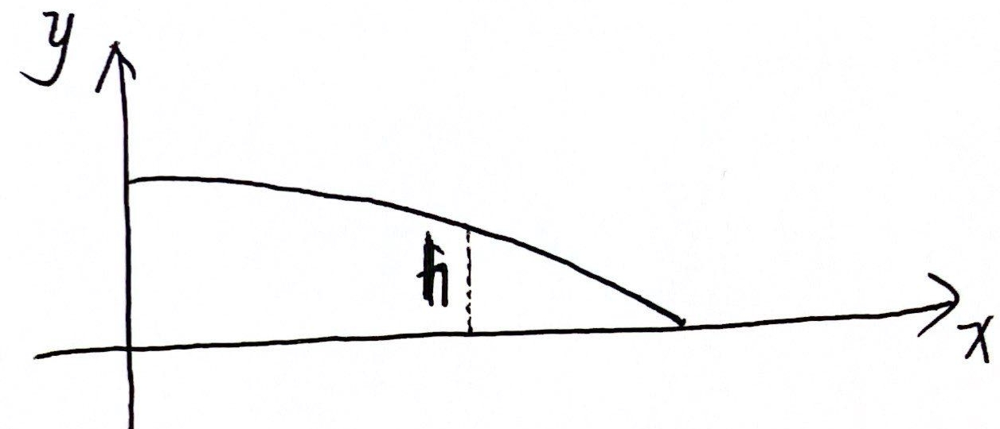

# cput 水透镜学习笔记

# [IYPT/AYPT 2024决赛|P2液滴显微镜、P13射击橡皮筋、P11吸管水泵_哔哩哔哩_bilibili](https://www.bilibili.com/video/BV1AE421j7Ko/?spm_id_from=333.788.recommend_more_video.1&vd_source=ae05c56ccfbcd06af0827b79097185c9)

### 水滴形状

受到压力
$$
\begin{equation}
p = p_0 +\Delta p + \rho g h
\end{equation}
$$
其中$\Delta p$ 是拉普拉斯压力
$$
\begin{equation}\label{拉式压力}
\Delta p = p_{in}-p_{out} = \gamma \left(\frac{1}{R_1}+ \frac{1}{R_2}\right)
\end{equation}
$$
$\gamma$  是表面张力系数， $R_1，R_2$ 是曲率半径。

曲率半径 $R$ ：
$$
\begin{equation}
R = \left | \frac{\left(1+{y'}^{2}\right)^{\frac 32}}{y''} \right |
\end{equation}
$$

可以看出 $y''< 0$ ，把 (2),(3) 代入 (1) 。
$$
p_0 - p +\rho g h - \frac{\gamma ~ h''_1}{\left(1+{h'}_{1}^{2}\right)^{\frac 32}} - \frac{\gamma ~ h''_2}{\left(1+{h'}_{2}^{2}\right)^{\frac 32}} = 0
$$
命 $ z = h - \frac{C}{\rho g} $ ，因为第二项是常数，所以 $z^{(n)} = h^{(n)}$ :
$$
\begin{equation}
\rho g z - \frac{\gamma ~ z''_1}{\left(1+{z'}_{1}^{2}\right)^{\frac 32}} - \frac{\gamma ~ z''_2}{\left(1+{z'}_{2}^{2}\right)^{\frac 32}} = 0
\end{equation}
$$
得到 $z$ 之后，$h$ 就能得到了

### 焦距

$$
\frac 1f = (n-1) \left( \frac1{R_1} - \frac1{R_2} + \frac{(n-1)d}{nR_1R_2} \right)
$$

因为一面是平面 $R_2 \to \infty$ :
$$
\begin{equation}\label{f}
f = \frac{R_1}{n-1}
\end{equation}
$$

### 物像距

$$
\begin{equation}
\frac 1p + \frac1q = \frac1f
\end{equation}
$$

$$
\begin{equation}\label{q}
q = \frac{pf}{p-f}
\end{equation}
$$

其中 $ p $ 是物距，$q$ 是像距，$f$ 是焦距

### 放大率

$$
M = \frac{|q|}{|p|}
$$

把 （$\ref{f}$）和（$\ref{q}$）代入：
$$
\begin{equation}\label{M}
M = \frac{f}{|p-f|} = \frac{R_1}{|p(n-1)-R_1|}
\end{equation}
$$

### 球面像差（Spherical aberration）

